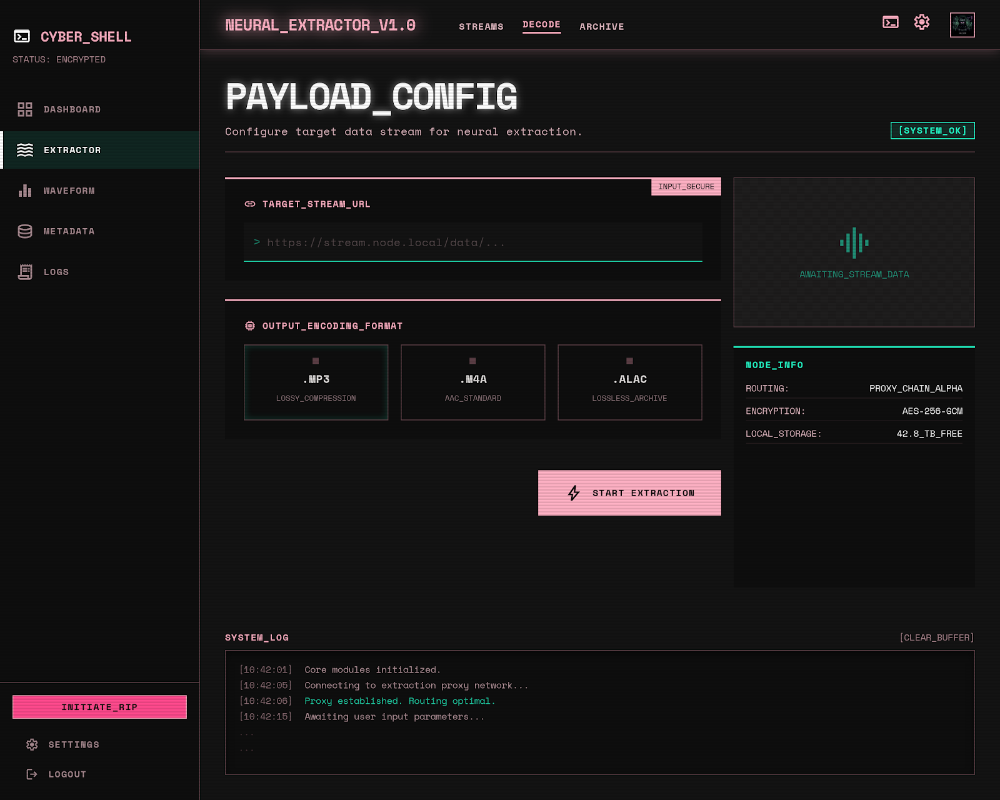
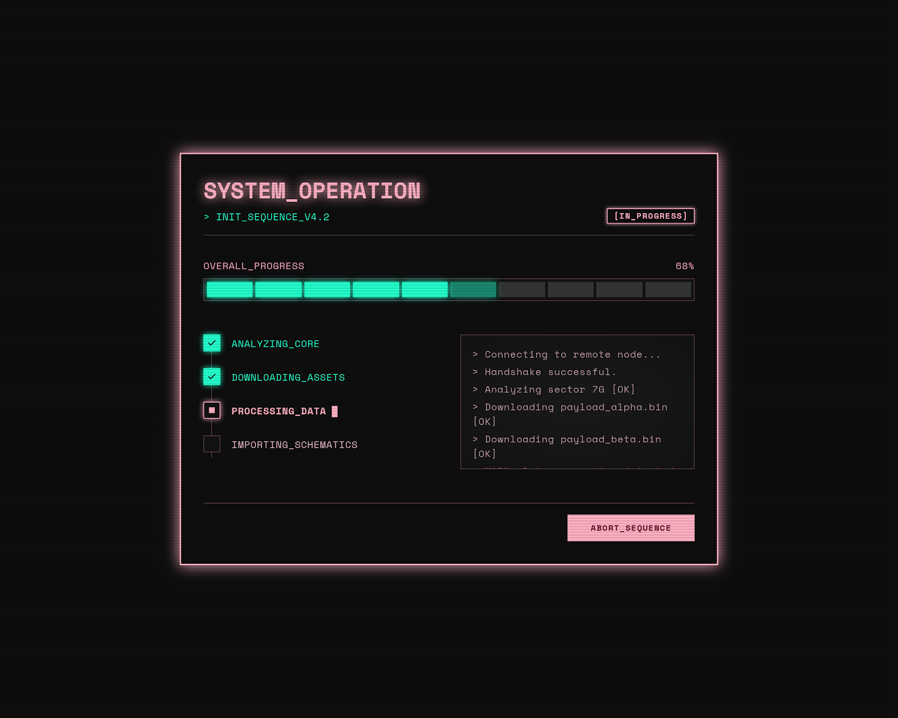
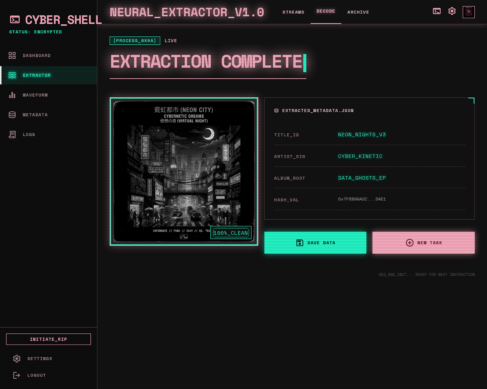

<div align="center">

# 听了么

**把在线视频中的声音，干净地保存为属于你的本地音乐。**

适用于 Windows x64 与 Apple Silicon Mac 的桌面音频提取工具。

[下载最新版](https://github.com/huang6668/tingleme/releases/latest) ·
[查看需求文档](./REQUIREMENTS.md) ·
[第三方许可](./THIRD_PARTY_NOTICES.md)

</div>

> [!NOTE]
> 当前只处理单个视频，不会自动下载整个播放列表。请仅保存你有权下载和使用的内容。

## 界面预览

### 快速配置

粘贴视频链接，选择 MP3、M4A 或 ALAC；歌曲信息和 Apple Music/iTunes 自动导入均可按需设置。



### 清晰的任务进度

获取信息、下载音频、格式处理和自动导入分阶段展示，下载阶段会显示实时百分比。



### 完整的处理结果

任务完成后可查看歌曲信息、封面和导入状态，并将成品保存到任意位置。



> 界面预览来自项目设计稿，实际版本已针对中文桌面操作流程完成适配。

## 下载与平台支持

前往 [GitHub Releases](https://github.com/huang6668/tingleme/releases/latest) 下载最新版本。

| 平台 | 文件 | 使用方式 |
| --- | --- | --- |
| Windows x64 | `*-win-x64-portable.exe` | 免安装版，下载后直接双击运行 |
| Windows x64 | `*-win-x64-setup.exe` | 安装版，可创建开始菜单和桌面快捷方式 |
| macOS Apple Silicon | `*-mac-arm64.dmg` | 适用于 M1、M2、M3、M4 等 Apple 芯片 Mac |
| macOS Apple Silicon | `*-mac-arm64.zip` | 压缩包版本，解压后运行 |

macOS Intel（x86_64）不再构建。Windows ARM 目前也不在支持范围内。

> [!IMPORTANT]
> 当前安装包尚未进行商业代码签名。Windows 可能显示 SmartScreen 提示；macOS 首次打开时可能需要前往“系统设置 → 隐私与安全性”确认运行。

## 核心功能

- 支持 YouTube、Bilibili 以及 yt-dlp 兼容的其他单视频来源
- 始终优先下载来源中最佳可用的音频流
- 输出高质量 MP3、M4A 或 Apple 生态常用的 ALAC
- 自动获取视频缩略图并嵌入音频文件
- 支持歌曲名、歌手和专辑等音乐元数据
- 展示获取信息、下载、处理和导入的完整任务进度
- 自动避免静默覆盖同名文件
- 可选复制到 Apple Music/iTunes 的自动添加目录
- 记忆输出格式和自动导入目录
- 支持取消、失败重试和连续处理下一个链接

### 关于音质

“最佳音质”指选择来源提供的最佳音频流，不代表能够超过来源本身的音质。将有损音频转换为 ALAC 不会恢复已经丢失的声音细节。

## 隐私与本地处理

听了么不需要用户账户，也没有自建的上传服务器。链接解析、音频下载、格式转换、封面和歌曲信息写入均由本机完成。

自动导入仅负责把成品复制到用户指定的 Apple Music/iTunes 自动添加目录，不会读取或上传音乐资料库。

## 为什么源码中没有其他 EXE

源码仓库不提交 FFmpeg、yt-dlp 或其他第三方可执行文件，开发电脑也不需要预装这些工具。

GitHub Actions 在云端构建时会：

1. 安装 Electron 构建依赖；
2. 下载当前目标平台对应的 FFmpeg 与 yt-dlp；
3. 使用官方 SHA-256 校验 yt-dlp；
4. 将工具放入被 Git 忽略的临时构建目录；
5. 生成 Windows x64 与 macOS arm64 发布文件。

yt-dlp 需要 JavaScript 运行时来完整解析 YouTube。应用会复用 Electron 自带的 Node 运行时，不额外捆绑 Deno 或另一套 Node。

## 云端构建

工作流配置位于 [`.github/workflows/build.yml`](./.github/workflows/build.yml)。推送与 `package.json` 版本一致、以 `v` 开头的标签即可构建 Release，例如：

```text
v1.0.5
```

构建矩阵目前包含：

- Windows x64：安装版与单文件免安装版
- macOS arm64：DMG 与 ZIP

完整源码检查和纯 Node 单元测试会在打包前运行。媒体工具只在 GitHub Actions 中下载，不会写入源码历史。

## 本地开发

如需自行开发，请准备 Node.js，然后运行：

```bash
npm install
npm run stage:tools
npm start
```

`npm run stage:tools` 会在本地下载媒体工具；如果你只需要修改界面或审查源码，可以不执行该命令。

## 许可与使用责任

项目自身代码采用 [MIT License](./LICENSE)。FFmpeg 与 yt-dlp 使用各自的许可证，详见 [THIRD_PARTY_NOTICES.md](./THIRD_PARTY_NOTICES.md)。

请遵守内容来源网站的使用条款、版权规则和所在地法律。听了么不用于绕过付费、权限、地区或访问控制。
